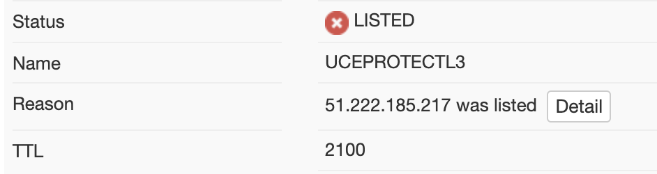

## What is Poste.io?
[Awesome link](https://google.com).
Poste.io is a Docker based mail server. With the help of Dokku, the deployment process is almost instant with a little configuration involved. Poste.io is completely open source, but like a lot of popular software there is always a paid version. In this guide, I will be using the free version.

## Part 0: is this the best solution for you?
Before we get started we need to ensure installing your own mail server is the best plan of action. If you are renting a server through DigitalOcean, OVH, or server reseller, the odds may not be in your favor when it comes to IP blacklisting. 

The best means of checking this is to head over to [mxtoolbox.com](https://mxtoolbox.com/blacklists.aspx), a service designed specifically to check if you're able to successfully send emails without getting sent directly to your recipient's spam box. 

If you don't get any errors, you're good to go!



However, if you get something that looks, you may be SOL. The easiest way to get your IP off the blacklist is to contact your hosting provider, but this can take anywhere from a week to many months. Most blacklists also offer a pay-to-remove service and this is normally going to be the fastest method of blacklist removal. It sucks, but it's fast "workaround." 
## Part 1: DNS Zone
We will start by modifying your our DNS zone. First, go to your domain configuration panel and add a type A record
```dns
mail.yourdomain.com A -> 1.2.3.4 (your IP)
```

Next, add three CNAME records

```dns
smtp.yourdomain.com CNAME mail.yourdomain.com
pop.yourdomain.com CNAME mail.yourdomain.com
imap.yourdomain.com CNAME mail.yourdomain.com
```

After that, add an MX record

```dns
yourdomain.com MX mail.yourdomain.com
```

Now, add a TXT record to register SPF

```dns
yourdomain.com. IN TXT "v=spf1 mx ~all"
```

There will be further DNS configuration to adhere to some of the newer mail standards, such as DMARC policy.

## Part 2: Preparation & Installation
Start by installing the [dokku-posteio](https://github.com/D1ceWard/dokku-posteio) plugin on your Dokku instance.

```shell
dokku plugin:install https://github.com/D1ceWard/dokku-posteio.git
```

After installing the plugin, start the container
```shell
dokku posteio:start
```

There is some optional configuraiton you can do to better customize the mail server to your likings:
- `--disable-clamav` helps reduce memory usage if you don't need antivirus protections
- `--disable-rspamd` helps reduce memory usage if you don't need a spam filtering system.
- `--disable-roundcup` helps reduce memory and storage usage if you would rather use your own mail client.

Now, we should be good to go! Head over to:
```
mail.yourdomain.com/admin/settings/#certificate
``` 

