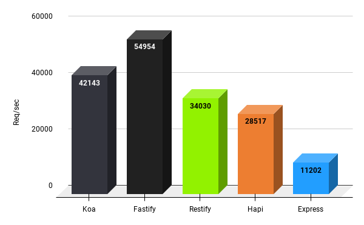

## Preface
After months working with Express I really started to dislike the back end framework. To me it felt very clunky and inefficient, especially when building out APIs and front end heavy applications. A friend of mine recommended Koa a while back and I kind brushed it off thinking Express was the fasted means of development. Turns out, I was wrong. 

Koa is a fairly new web framework designed by the team behind Express!

